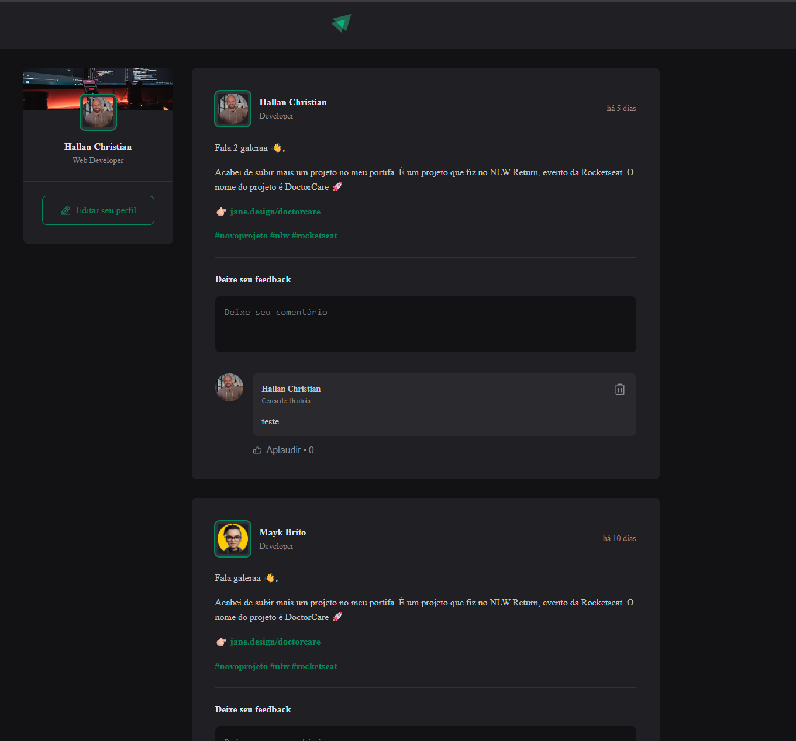

# Projeto Feed (TypeScript)

Projeto Feed é uma aplicação web construída em **React ^19.1.1 + Vite + TypeScript ~5.8.3**, que simula um feed de posts, com perfil, comentários e likes.

[](https://projetofeedts.hallanchristian.com.br)

## Visão Geral

O Projeto Feed é uma aplicação moderna e responsiva que exibe posts com informações de autor, avatar, cargo e conteúdo.  
A interface conta com **estilização via CSS Modules**, datas formatadas com **date-fns** e ícones do **phosphor-react**.  
Agora, toda a lógica e componentes são escritos em **TypeScript**, trazendo segurança de tipos e melhor manutenção.

## Tecnologias Utilizadas

- **React ^19.1.1**: biblioteca principal de UI.  
- **TypeScript ~5.8.3**: tipagem estática e maior robustez.  
- **Vite**: bundler e servidor de desenvolvimento rápido.  
- **CSS Modules**: estilização com escopo local.  
- **date-fns**: manipulação e formatação de datas.  
- **phosphor-react**: biblioteca de ícones.  

## Funcionalidades

1. **Listagem de posts**: renderização dinâmica de posts a partir de um array de objetos.  
2. **Componentização**: `Header`, `Sidebar`, `Post`, `Comment`, `Avatar`.  
3. **Comentários**: formulário para adicionar e remover comentários.  
4. **Interatividade**: botão de “like” em comentários.  
5. **Formatação de data**: exibição amigável e relativa (ex.: “há 2h”).  
6. **Segurança de tipos**: propriedades de componentes e dados validados pelo TypeScript.  

## Como Executar o Projeto

1. Clone o repositório:
   ```bash
   git clone https://github.com/hallancma/mba-rockeseat-sirius-projetos-07-projeto-feed-ts
   ```
2. Acesse a pasta do projeto:
   ```bash
   cd projeto-feed-ts
   ```
3. Instale as dependências:
   ```bash
   npm install
   ```
4. Execute o servidor de desenvolvimento:
   ```bash
   npm run dev
   ```
   - O terminal mostrará a URL (ex.: `http://localhost:5173`).

## Scripts Disponíveis

```jsonc
{
  "dev": "vite",
  "build": "tsc -b && vite build",
  "lint": "eslint .",
  "preview": "vite preview"
}
```

## Exemplos de Uso

- Ao abrir a aplicação, é exibida uma lista de posts.  
- Cada post contém informações do autor, data, conteúdo (parágrafos/links) e formulário de comentários.  
- Botão “Curtir” disponível para cada comentário.  
- Caso você passe propriedades erradas para os componentes, o **TypeScript** avisará em tempo de compilação.  

## Ver Projeto

Para ver em funcionamento:  
https://projetofeedts.hallanchristian.com.br

---
